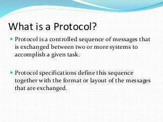

# what is protocol ? 
  
  1. protocol is set of rules. 
  2. protocol is set in website URL to set rules 
  3. types of protocol 

     1. http  (not secured) 
     2. https (secured) 
     3. smtp 
     4. MIME 
     5. FTP 
     6. POP
     7. IP 

     

     
  