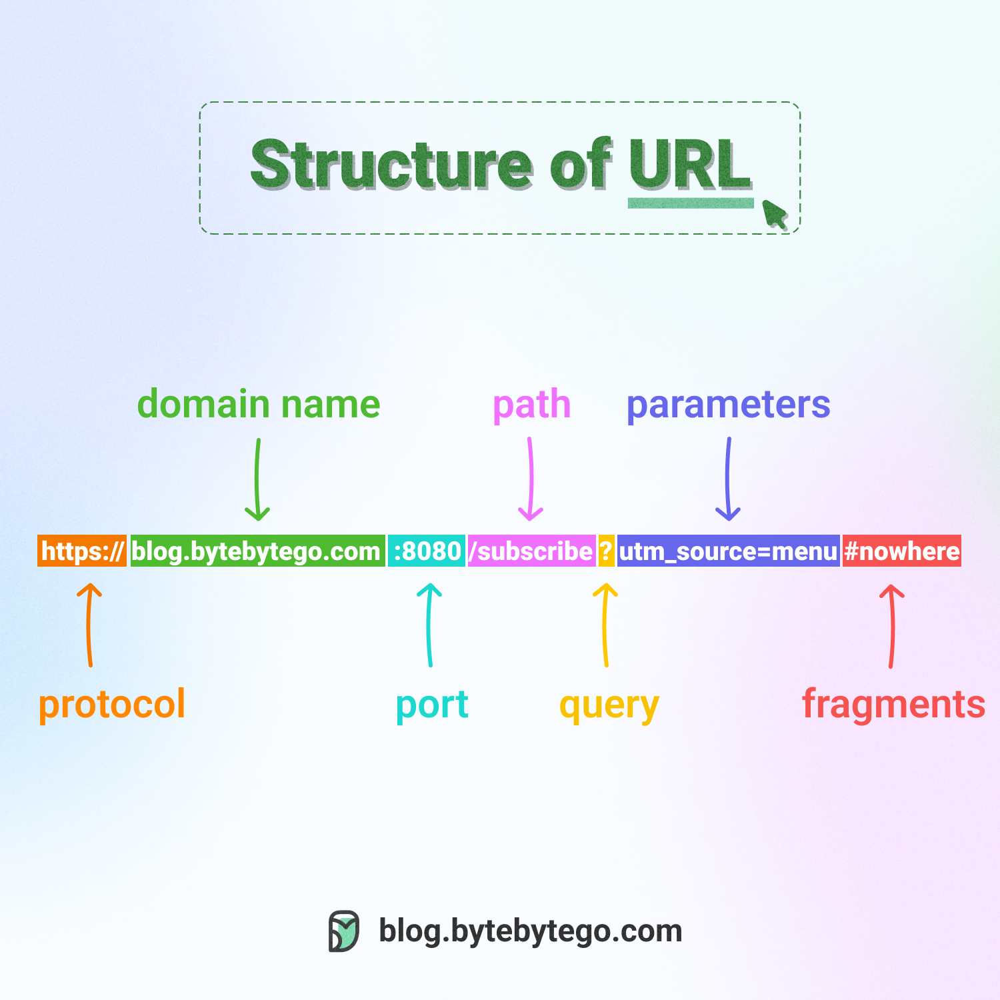

# what is URL ?
 
  1. URL stands for universal resource locator 
  2. each website have URL 
  3. URL are used to access website on internet
  
    **examples of URL**

    ```
    https://www.tops-int.com
    or
    https://www.amazon.in
    or
    https://www.flipkart.com
            
    ```

# types of URL 

  1. absolute URL 
    
     open any URL and direct home page is loading that URL is called absolute

     ```
        https://www.flipkart.com
        or 
        https://www.amazon.in
     ```

    1. relative URL 
    
     open any URL and and connected webpages url page is  called relative URL

     ```
        https://www.flipkart.com/viewcart
        or 
        https://www.flipkart.com/account/login

     ```


   **Architectures of URL**

     