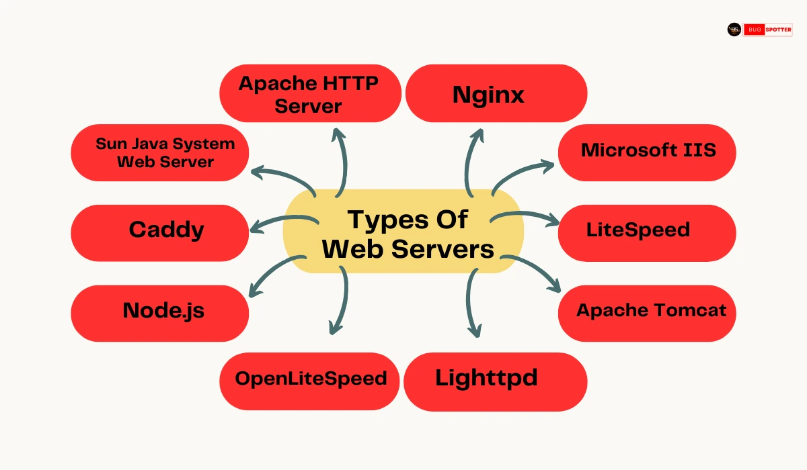

# what is web server ?

  1. web server is a machine where all clients are connected 
  2. web server accept request from client
  3. web server is also a router pass a messages in server

# web server types 

  1. apache 
  2. IIS 
  3. ngix 

