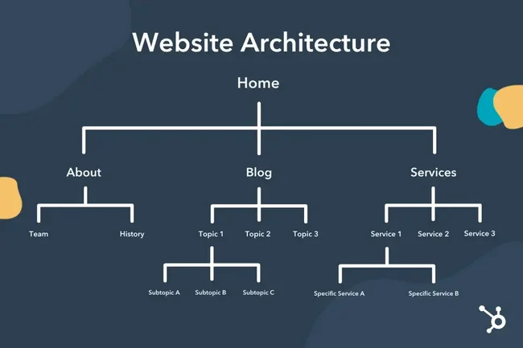

# what is website designing ? 

  1. website designing is creativity to create any website of webpages and home page.

  2. website designing is used to design webpages using 

     **website designing used some markup language**

     1. html & html5
     2. css * css3
     3. css preprocessor (sass)
     4. framework (bootstrap)
     5. tailwind css
     6. javascript & jquery special effects and advanced jquery
     7. live responsive projects  

     **website designing architectures**

      

     